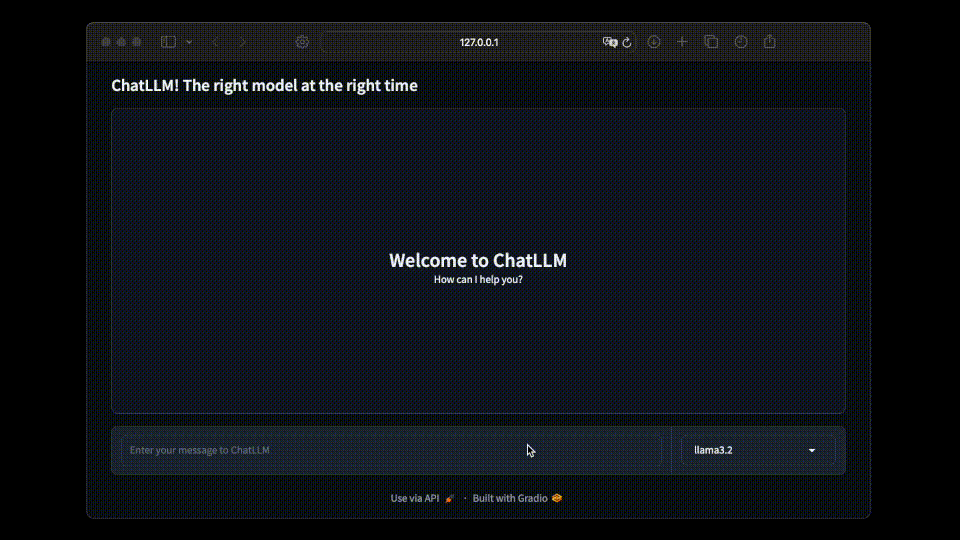

# ChatLLM 🤖


<div style="display: flex; align-center: flex-start;">
  <div style="flex: 2; max-width: 80%;">
        <div>
            
        </div>
        <p>A streamlined and versatile chatbot interface supporting various language models such as OpenAI GPT, Ollama Llama, and others. Designed for flexibility and ease of use, the project provides a Gradio-based frontend for seamless interactions.</p>
  </div>
</div>

---

## Features ⚙️

- **Multi-model support**: Compatible with OpenAI GPT, Ollama Llama, Mistral, and Qwen models.
- **Dynamic model management**: Automatically verifies and downloads models when needed.
- **Streamed responses**: Real-time streamed output for enhanced user experience.
- **Custom prompts**: System prompt management through `system_prompt.txt`.

---

## Requirements 🛠️

Ensure you have the following installed:

- Python 3.8+
- Required Python libraries (see `requirements.txt`)
- Ollama (if using Llama models): [Download here](https://ollama.com/download)

---

## Installation 💻

1. Clone the repository:

   ```bash
   git clone https://github.com/GiulioRusso/ChatLLM.git
   cd ChatLLM
   ```

2. Install dependencies:

   ```bash
   pip install -r requirements.txt
   ```

3. Ensure Ollama is installed and running if using Llama models.

---

## Usage 🦾

1. Open the Jupyter Notebook:

   ```bash
   jupyter-notebook main.ipynb
   ```

2. Place your system prompt file in the `prompts` folder as `system_prompt.txt`.

3. Run the notebook and interact with the chatbot interface.

---

## To Do 📋

- Add support for Claude models.
- Implement a file upload section for interactive file processing.
- Add functionality for image generation using integrated models.

---

## License ⚖️

This project is licensed under the MIT License.
